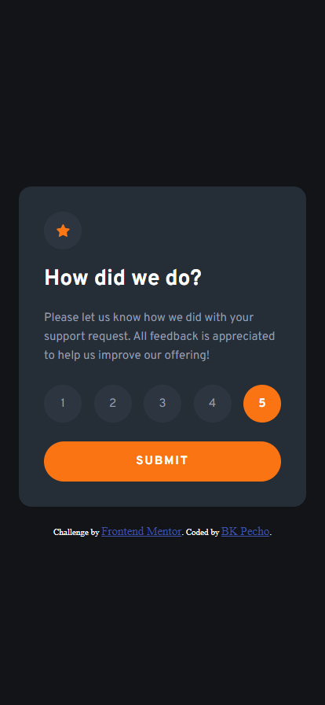
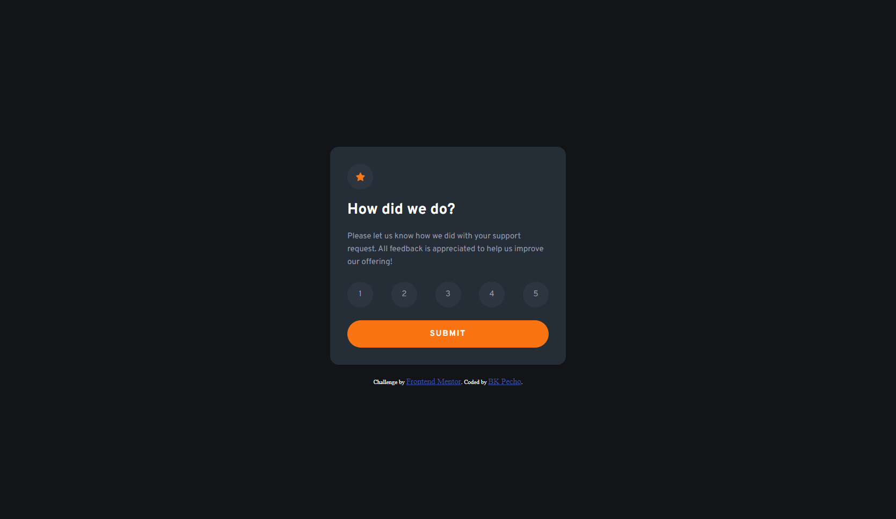

# Frontend Mentor - Interactive rating component solution

This is a solution to the [Interactive rating component challenge on Frontend Mentor](https://www.frontendmentor.io/challenges/interactive-rating-component-koxpeBUmI). Frontend Mentor challenges help you improve your coding skills by building realistic projects.

## Table of contents

- [Overview](#overview)
  - [The challenge](#the-challenge)
  - [Screenshot](#screenshot)
  - [Links](#links)
- [My process](#my-process)
  - [Built with](#built-with)
  - [What I learned](#what-i-learned)
- [Author](#author)

## Overview

### The challenge

Users should be able to:

- View the optimal layout for the app depending on their device's screen size
- See hover states for all interactive elements on the page
- Select and submit a number rating
- See the "Thank you" card state after submitting a rating

### Screenshot

### Links

- Solution URL: [Add solution URL here](https://your-solution-url.com)
- Live Site URL: [Add live site URL here](https://bk-interactive-rating-component.netlify.app)

## My process

### Built with

HTML

- Semantic HTML5 markup
- Flexbox Layout
- Mobile-first workflow

CSS

- CSS custom properties
- Transitions and Animations

JavaScript

- Variables
- DOM Manipulation
- Event Listeners
- Class Toggling

**Note: These are just examples. Delete this note and replace the list above with your own choices**

### What I learned

I learned how to create a rating component using JavaScript, HTML and CSS. I learned how to use the forEach method in JavaScript to loop through an array of elements and perform certain actions on each of them. I also learned how to add and remove classes on elements based on certain conditions. I became familiar with the concept of event listeners and how they can be used to trigger functions when a specific event occurs, such as a click. Additionally, I gained knowledge on how to use CSS transitions to create animations between different styles.

Overall, this project allowed me to expand my understanding of JavaScript, HTML and CSS, and how they can be used together to create dynamic and interactive web pages.

## Author

- Github - [BK Pecho](https://www.github.com/bkpecho)
- Frontend Mentor - [@bkpecho](https://www.frontendmentor.io/profile/bkpecho)
- Twitter - [@bkpecho](https://www.twitter.com/bkpecho)
